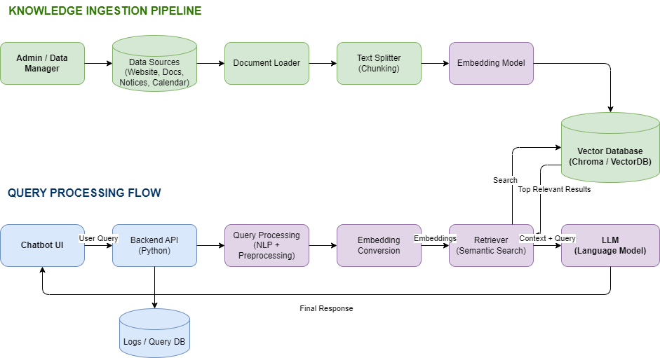

# 🎓 Interactive Campus Info AI Agent

An AI-powered Retrieval-Augmented Generation (RAG) system designed to help students, faculty, and staff quickly access information from official KUCET resources.

The system automatically crawls university websites, discovers academic documents, extracts content, processes information, and prepares a searchable knowledge base that powers an AI chatbot.

---

# 🚀 Project Overview

Students often struggle to find information scattered across multiple university pages and PDF documents.

Important information such as:

* Syllabus
* Examination schedules
* Circulars
* Notifications
* Department information
* Administrative notices

is spread across various pages and documents.

This project aims to centralize university knowledge and provide a conversational AI interface that can answer questions using official KUCET data.

---

# 🎯 Project Goal

Build a scalable university information assistant capable of answering:

* Who is the Principal of KUCET?
* What subjects are offered in B.Tech CSE Semester VI?
* What is the latest examination notification?
* What is the fee payment deadline?
* What scholarships are available?
* Where can I find a specific syllabus?

using official university resources instead of relying solely on generic LLM knowledge.

---

# 🏗 System Architecture



---

# 📊 Current Project Status

## Phase 1 — Knowledge Ingestion Pipeline

Status:

```text
COMPLETED ✅
```

The system can successfully:

* Crawl KUCET webpages
* Discover internal links
* Discover PDF resources
* Download PDFs
* Parse PDF content
* Clean extracted content
* Generate structured JSON documents

---

# ✅ Implemented Sub-Phases

## 1.1 Website Scraper

Features:

* Static page scraping
* HTTP page fetching
* HTML retrieval

Output:

```text
Website
↓
Raw HTML
```

---

## 1.2 HTML Content Cleaning

Features:

* Navigation removal
* Footer removal
* Sidebar cleanup
* Script removal
* Style removal
* Boilerplate filtering

Output:

```text
Raw HTML
↓
Clean Content
```

---

## 1.3 Metadata Extraction

Features:

* Title extraction
* URL tracking
* Page classification
* Content statistics

Example:

```json
{
  "title": "",
  "url": "",
  "page_type": ""
}
```

---

## 1.4 Deep BFS Crawler

Features:

* Breadth First Search
* Recursive crawling
* Internal link discovery
* Duplicate prevention
* Domain restriction

---

## 1.5 Navigation Discovery

Features:

* Navbar extraction
* Dropdown extraction
* Sidebar link extraction
* Nested page traversal

This enables discovery of department and resource pages hidden inside menus.

---

## 1.6 PDF Discovery

Features:

* PDF URL detection
* Recursive PDF discovery
* Internal PDF collection

Output:

```text
Website
↓
PDF Links
```

---

## 1.7 PDF Download Manager

Features:

* Automatic PDF downloading
* Duplicate prevention
* Download tracking

Metrics:

* PDFs discovered
* PDFs downloaded
* PDFs skipped
* Failed downloads

Output Directory:

```text
data/pdfs/
```

---

## 1.8 PDF Parsing

Technology:

```text
pdfplumber
```

Features:

* Multi-page extraction
* Table extraction
* Text extraction
* Error handling

Output:

```text
PDF
↓
Structured JSON
```

---

## 1.9 PDF Cleanup

Features:

* Header removal
* Footer removal
* University banner cleanup
* Department banner cleanup
* Duplicate content filtering

Purpose:

Reduce future embedding noise and improve retrieval quality.

---

## 1.10 Structured JSON Generation

Final output format:

```json
{
  "title": "",
  "source_pdf": "",
  "page_count": 0,
  "pages": [
    {
      "page_number": 1,
      "content": ""
    }
  ]
}
```

---

# 📂 Project Structure

```text
campus-ai-agent/
│
├── api/
│   └── main.py
│
├── chatbot/
│   ├── index.html
│   ├── script.js
│
├── scraper/
│   ├── scrape.py
│   ├── crawl.py
│   ├── pdf_discovery.py
│   ├── pdf_parser.py
│
├── data/
│   ├── processed/
│   ├── pdfs/
│   ├── pdf_text/
│
├── assets/
│
├── .env
├── requirements.txt
└── README.md
```

---

# ⚙️ Setup Instructions

## 1. Clone Repository

```bash
git clone <repository-url>
cd campus-ai-agent
```

---

## 2. Create Virtual Environment

```bash
python -m venv venv
```

Activate:

Windows:

```bash
venv\Scripts\activate
```

Linux / Mac:

```bash
source venv/bin/activate
```

---

## 3. Install Dependencies

```bash
pip install -r requirements.txt
```

---

## 4. Configure Environment Variables

Create:

```text
.env
```

Example:

```env
GROQ_API_KEY=your_api_key_here
```

---

## 5. Run Backend

```bash
uvicorn api.main:app --reload
```

Backend:

```text
http://127.0.0.1:8000
```

---

## 6. Run Frontend

Open:

```text
chatbot/index.html
```

or use:

```bash
Live Server
```

---


## Future Retrieval Flow

```text
User Question
↓
Embedding
↓
Vector Search
↓
Relevant Content
↓
LLM
↓
Answer
```

---

# 🔜 Future Enhancements

## Phase 2 — Chunking Engine

```text
JSON
↓
Chunks
```

Tasks:

* Page-aware chunking
* Overlap strategy
* Metadata preservation

---

## Phase 3 — Embedding Generation

```text
Chunks
↓
Vectors
```

Tasks:

* Embedding model integration
* Vector generation
* Metadata mapping

---

## Phase 4 — ChromaDB Integration

```text
Vectors
↓
Vector Database
```

Tasks:

* Collection creation
* Vector storage
* Similarity search

---

## Phase 5 — Retrieval Pipeline

```text
Question
↓
Semantic Search
↓
Relevant Chunks
```

---

## Phase 6 — AI Chatbot

```text
User
↓
Retriever
↓
LLM
↓
Answer
```

Features:

* Context-aware responses
* Source-grounded answers
* Citation support

---

## Phase 7 — Production Automation

Planned:

* Scheduled crawling
* Automatic PDF updates
* Automatic embedding refresh
* Deployment pipeline

---

# 🛠 Tech Stack

## Backend

* Python
* FastAPI

## Frontend

* HTML
* CSS
* JavaScript

## Data Collection

* Requests
* BeautifulSoup4

## PDF Processing

* pdfplumber

## AI

* Groq API

## Planned Technologies

* Sentence Transformers
* ChromaDB
* Supabase
* LangChain (optional)

---

# ⚠️ Current Limitations

Current system:

* Does not generate embeddings yet
* Does not perform semantic retrieval yet
* Does not store vectors yet
* Does not provide citations yet
* Does not automatically update from production sources

These features are planned in upcoming phases.

---

# 📝 Notes

* Developed as a Mini Project.
* Designed with scalability in mind.
* Focuses on clean architecture and incremental development.
* Data quality is prioritized before AI integration.
* Retrieval quality is dependent on the ingestion pipeline quality.

---

# 👨‍💻 Author

Developed as part of the Interactive Campus Info AI Agent Mini Project.

---
